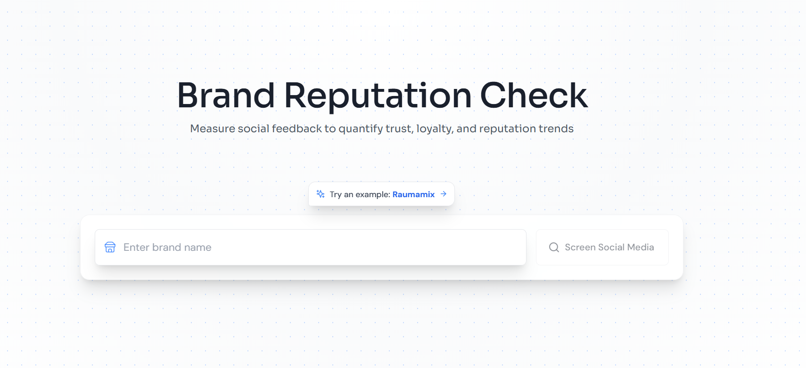

# Agentic Brand Reputation Check 🔍

Inspired by Mannus AI, this project is a lightweight Research Assistant Demo that automatically opens a browser to collect social media reputation data from platforms like YouTube, Facebook, TikTok, and more.
It’s designed as a practical tool for marketing, business intelligence, and banking teams who need quick, actionable insights into a company’s online presence.

[](https://drive.google.com/file/d/1BRtP5aqp5lEIY1eXp8BrHMypFjcq8mVA/view)

<p align="center"><i>(Click on Image to see Video Demo)</i></p>

## Features

- **Social Media Links Search**: Automatically find the right social media links
- **Multi-Source Research**: Gathers data from various sources including youtube, tiktok, facebook,...
- **Competitor Analysis**: Make brand reputation analysis vs. other competitors

Other interesting features thanks to this awesome repo: https://github.com/guy-hartstein/company-research-agent

- **Real-Time Progress Streaming**: Uses WebSocket connections to stream research progress and results
- **Modern React Frontend**: Responsive UI with real-time updates, progress tracking, and download options
- **Modular Architecture**: Built using a pipeline of specialized research and processing nodes

## Agent Framework

### Research Pipeline

The platform follows an agentic framework with specialized nodes that process data sequentially:

- `CompanyAnalyzer`: Find all social media links
- `Collector`: Aggregates all scraped data
- `Editor`: Compiles and formats the briefings into a final report

### Real-Time Communication System

The platform implements a WebSocket-based real-time communication system:

1. **Backend Implementation**:

   - Uses FastAPI's WebSocket support
   - Maintains persistent connections per research job
   - Sends structured status updates for various events

2. **Frontend Integration**:

   - React components subscribe to WebSocket updates
   - Updates are processed and displayed in real-time
   - Different UI components handle specific update types:
     - Scrape data progress
     - Briefing completion status
     - Report generation progress

## Setup

### Quick Setup (Recommended)

The easiest way to get started is using the setup script, which automatically detects and uses `uv` for faster Python package installation when available:

1. Clone the repository:

```bash
git clone https://github.com/lethienhoavn/brand-reputation.git
cd brand-reputation
```

2. Make the setup script executable and run it:

```bash
chmod +x setup.sh
./setup.sh
```

### Manual Setup

If you prefer to set up manually, follow these steps:

1. Clone the repository:

```bash
git clone https://github.com/lethienhoavn/brand-reputation.git
cd brand-reputation
```

2. Install backend dependencies:

```bash
# Optional: Create and activate virtual environment
# With uv (faster - recommended if available):
uv venv .venv
source .venv/bin/activate # on windows: .venv/Scripts/activate


# Or with standard Python:
# python -m venv .venv
# source .venv/bin/activate

# Install Python dependencies
# With uv (faster):
uv pip install -r requirements.txt

# Or with pip:
# pip install -r requirements.txt
```

3. Install frontend dependencies:

```bash
cd ui
npm install
```

4. **Set up Environment Variables**:

This project requires two separate `.env` files for the backend and frontend.

**For the Backend:**

Create a `.env` file in the project's root directory and add your backend API keys:

```env
OPENAI_API_KEY=your_openai_key

# Optional: Enable MongoDB persistence
# MONGODB_URI=your_mongodb_connection_string
```

### Running the Application

0. Warm up Facebook & Tiktok cookies:

```bash
cd scrape/first_login
python fb_login.py
python tiktok_login.py
```

1. Start the backend server (choose one):

```bash
# Option 1: Direct Python Module
python -m application.py

# Option 2: FastAPI with Uvicorn
uvicorn application:app --reload --port 8000
```

2. In a new terminal, start the frontend:

```bash
cd ui
npm run dev
```

3. Access the application at `http://localhost:5174`

> **⚡ Performance Note**: If you used `uv` during setup, you'll benefit from significantly faster package installation and dependency resolution. `uv` is a modern Python package manager written in Rust that can be 10-100x faster than pip.

## Acknowledgments

- Kudos to this repo [Company Research Agent](https://github.com/guy-hartstein/company-research-agent) for the beautiful UI & clean workflow
